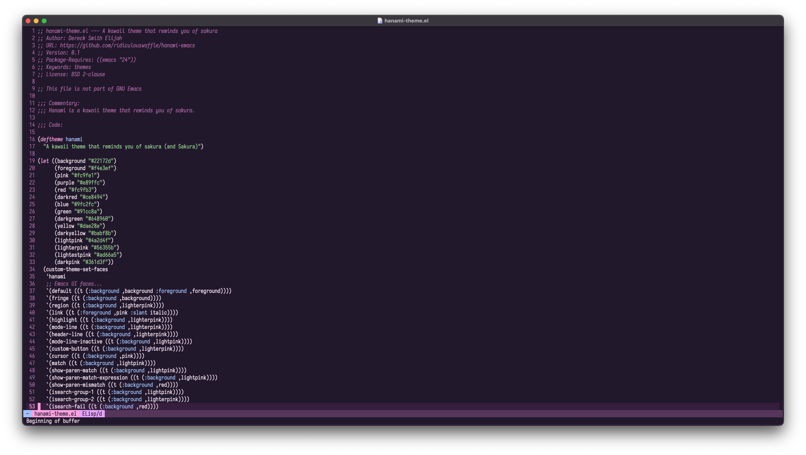

# Hanami
Hanami is a dark kawaii theme that reminds you of sakura (or even Sakura, IYKYK)

This theme is still in it's early stages. It's usable, but you won't have the color pallete in third party packages such as Magit, Company and Corfu yet.



### What was the inspiration behind this theme?
I've always been a theme-hopper across various editors. When I switched to Emacs, I found myself cycling through themes like Nord and Gruvbox, but none quite stuck. I wanted something cute and unique, so I decided to create Hanami!

### Why name it Hanami?
Hanami(花見) in Japanese means "[flower festival](https://en.wikipedia.org/wiki/Hanami)", in which people admire flowers under a tree, mostly cherry blossom flowers. Since the theme I use is inspired by cherry blossom flowers,
I named the theme Hanami after some brainstorming with ChatGPT.

## Installation

- Download the `hanami-theme.el` file to your `custom-theme-load-path` directory (you can find it out by executing `M-: custom-theme-load-path`).
- Load it with `M-x load-theme` and enter `hanami`

### Will it be available on MELPA or other repositories? 

Yeah. I will be submitting to MELPA soon to make installation even easier.

In the meanwhile, if you have `straight.el`, you can install the theme like this:
```elisp
;; Install the package
(straight-use-package
 '(hanami
   :type git
   :host nil
   :repo "https://github.com/ridiculouswaffle/hanami-emacs.git"))

;; Emacs doesn't recognize this as a theme, so add it to themes load path
(add-to-list 'custom-theme-load-path
             (expand-file-name "hanami" (straight--build-dir)))

;; Then load it.
(load-theme 'hanami t)
```

## How can I customize this theme?

This theme is very easy to customize. Just edit the `hanami-theme.el` file

## Contributing

Contributions are welcome! Please fork this repository, make your changes and send a pull request, and I'll check it out.

## License

This theme is licensed under the [BSD 2-Clause License](LICENSE).
